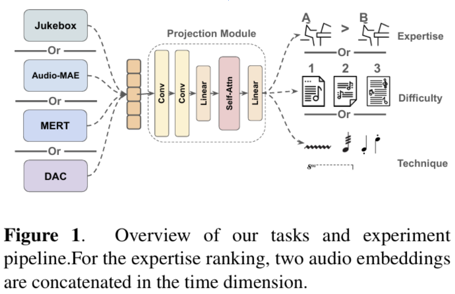

# Piano Judge with Music2Latent

Michael Xie, Nick Boyko, Haochen Wang, Jingkai Hu

## Introduction

Learning about DL and audio encoders from recent publication at ISMIR-2024. 
[Original Paper]: 
1. Piano Judges: https://arxiv.org/abs/2407.04518 
2. Music2latent: https://arxiv.org/abs/2408.06500

Piano Judges employs several audio encoders for solo piano recording understanding, the project aims to integrate a new audio encoder Music2Latent into this pipeline, and test Music2Latent MIR downstream task performance in audio understanding. 

## Dataset

Technique Audio, part of the PID dataset released by Piano Judges. 

1. Download the data through this link provided by the author : https://drive.google.com/drive/folders/1IuV5Vo6Nc5GE4KYbfanv8B_AzYu02NYI

## Model

Diagram from original Piano Judge Paper

Explain the model architecture that your project uses. Be sure to include an architecture diagram here!

## Using this Repository

to be completed later

### Requirements

Give instructions on setting up the environment.

```
conda env create -f environment.yml
conda activate hotdog
```

### Training the Model

to be completed later

```
python train.py
```

### Using the Model

to be completed later
Explain how to use the model. Show a few examples in your `demo.ipynb`.

## References

```
@inproceedings{Zhang2024FromJudges,
    address = {San Francisco, USA},
    author = {Zhang, Huan and Liang, Jinhua and Dixon, Simon},
    booktitle = {Proceedings of the International Society for Music Information Retrieval Conference (ISMIR)},
    title = {From Audio Encoders to Piano Judges: Benchmarking Performance Understanding for Solo Piano},
    year = {2024}
}
@article{pasini2024music2latent,
  title={Music2latent: Consistency autoencoders for latent audio compression},
  author={Pasini, Marco and Lattner, Stefan and Fazekas, George},
  journal={arXiv preprint arXiv:2408.06500},
  year={2024}
}


```

You __must__ include references to any papers or GitHub repositories which you used when working on your project.

If you borrowed code from another GitHub repository, you __must__ clearly write in your comments what is outsourced (and from where) and what is your own.

Failure to properly credit external sources constitutes plagarism.
